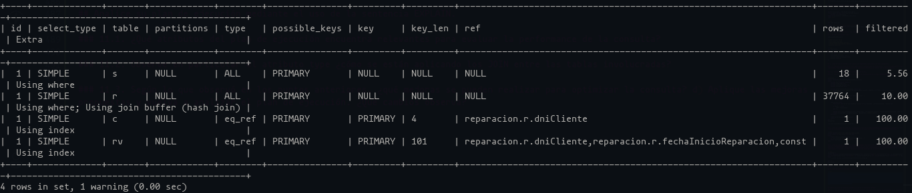

# Practica 4 - SQL

# Consultas SQL

## Llevar a SQL las siguientes consultas antes realizadas en Álgebra Relacional:

- DUEÑO (id_dueño, nombre, teléfono, dirección, dni)
- CHOFER (id_chofer, nombre, teléfono, dirección, fecha_licencia_desde, fecha_licencia_hasta, dni)
- AUTO (patente, id_dueño, id_chofer, marca, modelo, año)
- VIAJE (patente, hora_desde, hora_hasta, origen, destino, tarifa, metraje)

### a. Listar el dni, nombre y teléfono de todos los dueños que NO son choferes

```sql
SELECT dni, nombre, telefono
FROM DUEÑO
WHERE dni NOT IN (SELECT dni
                  FROM CHOFER)
```

### b. Listar la patente y el id_chofer de todos los autos a cuyos choferes les caduca la licencia el 01/01/2024

// Se puede usar el natural join??

```sql
SELECT a.patente, a.id_chofer
FROM AUTO as a NATURAL JOIN CHOFER as c
WHERE c.fecha_licencia_hasta like 20240101
```

- ESTUDIANTE(#legajo, nombreCompleto, nacionalidad, añoDeIngreso, códigoDeCarrera)
- CARRERA(códigoDeCarrera, nombre)
- INSCRIPCIONAMATERIA(#legajo, códigoDeMateria)
- MATERIA(códigoDeMateria, nombre)

### a. Obtener el nombre de los estudiantes que ingresaron en 2019.

```sql
SELECT nombreCompleto
FROM ESTUDIANTE
WHERE añoDeIngreso = '2019'
```

### b. Obtener el nombre de los estudiantes con nacionalidad “Argentina” que NO estén en la carrera con código “LI07”

```sql
-- Forma 1
SELECT nombreCompleto
FROM ESTUDIANTE
WHERE nacionalidad = 'Argentina' 
    and codigoDeCarrera <> 'LI07'
```
```sql
-- Forma 2
SELECT nombreCompleto
FROM ESTUDIANTE
WHERE nacionalidad = 'Argentina'
    and codigoDeCarrera NOT IN (SELECT codigoDeCarrera
                                FROM CARRERA
                                WHERE codigoDeCarrera = 'LI07')
```

### Compare las resoluciones de estos ejercicios con las realizadas en álgebra relacional, que paralelismo encuentra entre las diferentes operaciones de AR en SQL y en las formas de las resoluciones?

- SQL está basado en AR, por esa razón es que sus consultas son parecidas. Si embargo, por las caracterísitcas de SQL, las consultas son distintas, por ejemplo, en Álgebra Relacional podemos modularizar las consultas y en SQL podemos hacer subconsultas.
- En AR solo se indica el nombre de la relación, en SQL debemos hacerlo con la cláusula `FROM`.

|     | Proyección | Selección | Renombre | Prod. Cartesiano |
| --- | ---------- | --------- | -------- | ---------------- |
| AR  |     π      |     σ     |     ρ    |         ⨯        |
| SQL |  `SELECT`  |  `WHERE`  |   `as`   |    INNER JOIN    |

# Ejercicios

## 1. Crear usuarios para las bases de datos, usando los nombres reparacion para la versión normalizada y reparacion_dn para la desnormalizada. Asigne a estos todos los permisos sobre sus respectivas tablas. Habiendo creado estos usuarios, evitar el uso de root para el resto del trabajo práctico.

```sql
CREATE USER 'reparacion'@'localhost'
    IDENTIFIED with caching_sha2_password BY '1234';

GRANT ALL PRIVILEGES ON reparacion.* TO 'reparacion'@'localhost';
```

```sql
CREATE USER 'reparacion_dn'@'localhost'
    IDENTIFIED with caching_sha2_password BY '1234';

GRANT ALL PRIVILEGES ON reparacion_dn.* TO 'reparacion_dn'@'localhost';
```

### 1.1. Adicionalmente, en ambas bases:

- Cree un usuario sólo con permisos para realizar consultas de selección, es decir que no puedan realizar cambios en la base. Use los nombres 'reparacion_select’ y 'reparacion_dn_select’.

```sql
CREATE USER 'reparacion_select'@'localhost'
    IDENTIFIED with caching_sha2_password BY '1234';

GRANT SELECT ON reparacion.* TO 'reparacion_select'@'localhost';
```

```sql
CREATE USER 'reparacion_dn_select'@'localhost'
    IDENTIFIED with caching_sha2_password BY '1234';

GRANT SELECT ON reparacion_dn.* TO 'reparacion_dn_select'@'localhost';
```

- Cree un usuario que pueda realizar consultas de selección, inserción, actualización y eliminación a nivel de filas, pero que no puedan modificar el esquema. Use los nombres 'reparacion_update’ y 'reparacion_dn_update’.

```sql
CREATE USER 'reparacion_update'@'localhost'
    IDENTIFIED with caching_sha2_password BY '1234';

GRANT SELECT, INSERT, UPDATE, DELETE ON reparacion.* TO 'reparacion_update'@'localhost';
```

```sql
CREATE USER 'reparacion_dn_update'@'localhost'
    IDENTIFIED with caching_sha2_password BY '1234';

GRANT SELECT, INSERT, UPDATE, DELETE ON reparacion_dn.* TO 'reparacion_dn_update'@'localhost';
```

- Cree un usuario que tenga los permisos de los anteriores, pero que además pueda modificar el esquema de la base de datos. Use los nombres 'reparacion_schema’ y 'reparacion_dn_schema’.

```sql
CREATE USER 'reparacion_schema'@'localhost'
    IDENTIFIED with caching_sha2_password BY '1234';

GRANT SELECT, INSERT, UPDATE, DELETE, CREATE, ALTER ON reparacion.* TO 'reparacion_schema'@'localhost';
```

```sql
CREATE USER 'reparacion_dn_schema'@'localhost'
    IDENTIFIED with caching_sha2_password BY '1234';

GRANT SELECT, INSERT, UPDATE, DELETE, CREATE, ALTER ON reparacion_dn.* TO 'reparacion_dn_schema'@'localhost';
```

## 2. Listar dni, nombre y apellido de todos los clientes ordenados por dni en forma ascendente. Realice la consulta en ambas bases. ¿Qué diferencia nota en cuanto a performance? ¿Arrojan los mismos resultados? ¿Qué puede concluir en base a las diferencias halladas?

```sql
USE reparacion;
SHOW TABLES;

+----------------------+
| Tables_in_reparacion |
+----------------------+
| cliente              |
| reparacion           |
| repuestoreparacion   |
| revisionreparacion   |
| sucursal             |
+----------------------+

DESCRIBE cliente;

+-----------------------+--------------+------+-----+---------+-------+
| Field                 | Type         | Null | Key | Default | Extra |
+-----------------------+--------------+------+-----+---------+-------+
| dniCliente            | int          | NO   | PRI | NULL    |       |
| nombreApellidoCliente | varchar(255) | NO   |     | NULL    |       |
| domicilioCliente      | varchar(255) | NO   |     | NULL    |       |
| ciudadCliente         | varchar(255) | YES  |     | NULL    |       |
| tarjetaPrimaria       | varchar(255) | YES  |     | NULL    |       |
| tarjetaSecundaria     | varchar(255) | YES  |     | NULL    |       |
+-----------------------+--------------+------+-----+---------+-------+
```

```sql
SELECT dniCliente, nombreApellidoCliente
FROM cliente
ORDER BY dniCliente ASC;

-- 20000 rows in set (0.09 sec)
```

```sql
USE reparacion_dn;
SHOW TABLES;

+-------------------------+
| Tables_in_reparacion_dn |
+-------------------------+
| reparacion              |
+-------------------------+

DESCRIBE reparacion;

+----------------------------+--------------+------+-----+---------+-------+
| Field                      | Type         | Null | Key | Default | Extra |
+----------------------------+--------------+------+-----+---------+-------+
| codSucursal                | int          | YES  |     | NULL    |       |
| dniCliente                 | int          | NO   | PRI | NULL    |       |
| fechaInicioReparacion      | datetime     | NO   | PRI | NULL    |       |
| cantDiasReparacion         | int          | YES  |     | NULL    |       |
| telefonoReparacionCliente  | varchar(45)  | YES  |     | NULL    |       |
| direccionReparacionCliente | varchar(255) | YES  |     | NULL    |       |
| ciudadReparacionCliente    | varchar(255) | YES  |     | NULL    |       |
| tarjetaReparacion          | varchar(255) | YES  |     | NULL    |       |
| nombre                     | varchar(255) | NO   |     | NULL    |       |
| domicilioSucursal          | varchar(255) | YES  |     | NULL    |       |
| ciudadSucursal             | varchar(45)  | YES  |     | NULL    |       |
| encargadoSucursal          | varchar(45)  | YES  |     | NULL    |       |
| m2                         | int          | YES  |     | NULL    |       |
| nombreApellidoCliente      | varchar(255) | NO   |     | NULL    |       |
| domicilioCliente           | varchar(255) | NO   |     | NULL    |       |
| ciudadCliente              | varchar(255) | YES  |     | NULL    |       |
| tarjetaPrimaria            | varchar(255) | YES  |     | NULL    |       |
| tarjetaSecundaria          | varchar(255) | YES  |     | NULL    |       |
| repuestoReparacion         | varchar(30)  | NO   | PRI | NULL    |       |
| empleadoReparacion         | varchar(30)  | NO   | PRI |         |       |
+----------------------------+--------------+------+-----+---------+-------+
```

```sql
SELECT dniCliente, nombreApellidoCliente
FROM reparacion
ORDER BY dniCliente ASC;

-- 162252 rows in set (0.28 sec)
```

- La consulta en __reparacion__ es mucho más eficiente que en __reparacion_dn__.
- Además del tiempo, en la tabla __cliente__ de __reparacion__ hay más clientes que en la de __reparacion__ de __reparacion_dn__.
- La conclución es que el proceso de normalización también favorece al tiempo de resolución de las consultas (más allá de si estén optimizadas o no).

## 3. Hallar aquellos clientes que para todas sus reparaciones siempre hayan usado su tarjeta de crédito primaria (nunca la tarjeta secundaria). Realice la consulta en ambas bases.

// Preguntar como hacer para que los clientes aparezcan una sola vez. => con el `DISTINCT`

```sql
USE reparacion;

SELECT c.dniCliente, c.nombreApellidoCliente
FROM cliente as c NATURAL JOIN reparacion as r
WHERE c.tarjetaPrimaria = r.tarjetaReparacion
    AND c.dniCliente NOT IN (
        SELECT c.dniCliente
        FROM cliente as c NATURAL JOIN reparacion as r
        WHERE c.tarjetaSecundaria = r.tarjetaReparacion
    )
GROUP BY c.dniCliente;
```

```sql
USE reparacion_dn;

SELECT dniCliente, nombreApellidoCliente
FROM reparacion
WHERE tarjetaPrimaria = tarjetaReparacion
    and dniCliente NOT IN (
        SELECT dniCliente
        FROM reparacion
        WHERE tarjetaSecundaria = tarjetaReparacion
    );
```

## 4. Crear una vista llamada ‘sucursalesPorCliente’ que muestre los dni de los clientes y los códigos de sucursales de la ciudad donde vive el cliente. Cree la vista en ambas bases.

```sql
USE reparacion;

CREATE VIEW sucursalesPorCliente AS
SELECT c.dniCliente, s.codSucursal
FROM cliente as c INNER JOIN sucursal s
    ON c.ciudadCliente = s.ciudadSucursal;
```

```sql
USE reparacion_dn;

CREATE VIEW sucursalesPorCliente AS
SELECT dniCliente, codSucursal
FROM reparacion
WHERE ciudadCliente = ciudadSucursal;
```

## 5. En la base normalizada, hallar los clientes que dejaron vehículos a reparar en todas las sucursales de la ciudad en la que viven

- Restricción: resolver este ejercicio sin usar la cláusula “NOT EXIST”.
- Nota: limite su consulta a los primeros 100 resultados, caso contrario el tiempo que tome puede ser excesivo.

### 5.1. Realice la consulta sin utilizar la vista creada anteriormente

```sql
USE reparacion;

-- Con NOT EXISTS
SELECT c.dniCliente, c.nombreApellidoCliente
FROM cliente as c
WHERE NOT EXISTS (
    SELECT s.codSucursal
    FROM sucursal as s
    WHERE s.ciudadSucursal = c.ciudadCliente;

    EXCEPT

    SELECT r.codSucursal
    FROM reparacion as r
    WHERE r.dniCliente = c.dniCliente;
)
LIMIT 100;

-- 1. Obtiene todas las sucursales de la ciudad del cliente
-- 2. Obtiene todas las sucursales de la misma ciudad del cliente en las que haya hecho reparaciones al menos una vez.
-- 3. Si la cantidad de sucursales de la misma ciudad en las que hizo reparaciones es igual a las sucursales de la misma ciudad que el cliente, el cliente aparece en la tabla resultado.
SELECT c.dniCliente, c.nombreApellidoCliente
FROM cliente as c
WHERE (
    (SELECT COUNT(s.codSucursal)
    FROM sucursal s
    WHERE c.ciudadCliente = s.ciudadSucursal)
    =
    (SELECT COUNT DISTINCT(r.codSucural)
    FROM reparacion r NATURAL JOIN sucursal s
    WHERE c.dniCliente = r.dniCliente AND
        c.ciudadCliente = s.ciudadSucursal)
)
LIMIT 100;
```

```sql
USE reparacion_dn;

SELECT dniCliente, nombreApellidoCliente
FROM reparacion
WHERE dniCliente IN (
    SELECT dniCliente
    FROM reparacion
    WHERE codSucursal IN (
        SELECT codSucursal
        FROM reparacion
        WHERE ciudadSucursal = ciudadCliente
    )
)
LIMIT 100;
```

### 5.2. Realice la consulta utilizando la vista creada anteriormente

```sql
USE reparacion;

SELECT dniCliente, nombreApellidoCliente
FROM cliente NATURAL JOIN sucursalesPorCliente
    NATURAL JOIN reparacion
GROUP BY dniCliente, nombreApellidoCliente
LIMIT 100;
```

```sql
USE reparacion_dn;

SELECT r.dniCliente, r.nombreApellidoCliente
FROM reparacion as r NATURAL JOIN sucursalesPorCliente as s
LIMIT 100;
```

# En la base normalizada realice los siguientes ejercicios:

## 6. Agregar la siguiente tabla:

REPARACIONESPORCLIENTE

- idRC: int(11) PK AI
- dniCliente: int(11)
- cantidadReparaciones: int(11)
- fechaultimaactualizacion: datetime
- usuario: char(16)

```sql
USE reparacion;

CREATE TABLE reparacionesporcliente (
    idRC INT(11) AUTO_INCREMENT PRIMARY KEY,
    dniCliente INT(11),
    cantidadReparaciones INT(11),
    fechaUltimaActualizacion DATE,
    usuario CHAR(16)
);
```

## 7. Crear un Stored Procedure que realice los siguientes pasos dentro de una transacción:

### 7.1. Realizar una consulta que para cada cliente (identificado por dniCliente), calcule la cantidad de reparaciones que tiene registradas. Registrar la fecha en la que se realiza la consulta y el usuario con el que la realizó.


### 7.2. Guardar el resultado de la consulta en un cursor.

### 7.3. Iterar el cursor e insertar los valores correspondientes en la tabla REPARACIONESPORCLIENTE.

```sql
DELIMITER //
CREATE PROCEDURE cantidadDeReparacionesPorCliente()
BEGIN
    DECLARE done TINYINT DEFAULT 0;
    DECLARE clienteDNI INT;
    DECLARE cantReparaciones INT;
    DECLARE fechaActual DATE;

    DECLARE cursorCantidadReparaciones CURSOR FOR
        SELECT dniCliente, COUNT(*) AS cantidadReparaciones, CURDATE() AS fechaUltimaActualizacion
        FROM reparacion
        GROUP BY dniCliente;
    
    DECLARE CONTINUE HANDLER FOR NOT FOUND SET done = 1;

    OPEN cursorCantidadReparaciones;
    START TRANSACTION;

    loop_cursor: LOOP
        FETCH NEXT FROM cursorCantidadReparaciones INTO clienteDNI, cantReparaciones, fechaActual;

        IF done = 1 THEN
            LEAVE loop_cursor;
        END IF;

        INSERT INTO reparacionesporcliente (dniCliente, cantidadReparaciones, fechaUltimaActualizacion, usuario)
        VALUES (clienteDNI, cantReparaciones, fechaActual, CURRENT_USER());
    END LOOP;

    CLOSE cursorCantidadReparaciones;
    COMMIT;
END //
DELIMITER;

CALL cantidadDeReparacionesPorCliente();
```

## 8. Crear un Trigger de modo que al insertar un dato en la tabla REPARACION, se actualice la cantidad de reparaciones del cliente, la fecha de actualización y el usuario responsable de la misma (actualiza la tabla REPARACIONESPORCLIENTE).

```sql
CREATE TRIGGER actualizar_cantidad_reparaciones
AFTER INSERT ON reparacion FOR EACH ROW
BEGIN
    UPDATE reparacionesporcliente
    SET cantidadReparaciones = cantidadReparaciones + 1
    WHERE dniCliente = NEW.dniCliente;
END;
```

## 9. Crear un stored procedure que sirva para agregar una reparación, junto con una revisión de un empleado (REVISIONREPARACION) y un repuesto (REPUESTOREPARACION) relacionados dentro de una sola transacción. El stored procedure debe recibir los siguientes parámetros: dniCliente, codSucursal, fechaReparacion, cantDiasReparacion, telefonoReparacion, pagoConTarjetaPrimaria (booleano), empleadoReparacion, repuestoReparacion. Los atributos restantes deben ser obtenidos de la tabla Cliente.

```SQL
DELIMITER //
CREATE PROCEDURE agregarReparacionRevisionRepuesto(IN dniCliente INT(11), IN codSucursal INT, IN fechaReparacion DATE, IN cantDiasReparacion INT, IN telefonoReparacion VARCHAR(45), IN pagoConTarjetaPrimaria BIT, IN empleadoReparacion VARCHAR(30), IN repuestoReparacion VARCHAR(30))
BEGIN
    -- Puede ser que cliente no tenga telefono en la tabla?

END //
DELIMITER;
```

## 10.

## 11. Considerando la siguiente consulta:

```sql
EXPLAIN select count(r.dniCliente)
from reparacion r, cliente c, sucursal s, revisionreparacion rv
where r.dnicliente=c.dnicliente
    and r.codsucursal=s.codsucursal
    and r.dnicliente=rv.dnicliente
    and r.fechainicioreparacion=rv.fechainicioreparacion
    and empleadoreparacion = 'Maidana'
    and s.m2<200
    and s.ciudadsucursal='La Plata';
```

## Analice su plan de ejecución mediante el uso de la sentencia EXPLAIN.



### 11.1. ¿Qué atributos del plan de ejecución encuentra relevantes para evaluar la performance de la consulta?

- Los atributos relevantes son:
  - **Type**: Determina si se usa el join eficiente.
  - **Rows**: Menos filas => Más eficiente
  - **Key**: Determina si se usan los índices adecuados.
  - **Extra**

### 11.2. Observe en particular el atributo type ¿cómo se están aplicando los JOIN entre las tablas involucradas?


- Las tablas *s* y *r* se escanean en su totalidad (**ALL**). La tabla *c* y la tabla *rv* se unen mediante claves primarias y se usan índices (**eq_ref**), esto es más eficiente porque las tablas se escanean parcialmente.

### 11.3. Según lo que observó en los puntos anteriores, ¿qué mejoras se pueden realizar para optimizar la consulta?

- Podríamos agregar índices a las tablas *s* y *r*, por ejemplo, para los atributos `ciudadsucursal` y/o `m2`.

### 11.4. Aplique las mejoras propuestas y vuelva a analizar el plan de ejecución. ¿Qué cambios observa?

- Disminuyó la cantidad de filas. Sin embargo no disminuyó en la tabla r, ya que no tenemos índices en ella.

# Índices.

## 1. Escriba una consulta para obtener la información de aquellos clientes cuyo nombre empiece con la letra “D”. Utilice la sentencia EXPLAIN para analizar los atributos relevantes del plan de ejecución de esta consulta, preste especial atención a los índices utilizados y el número estimado de filas a analizar.

```sql
EXPLAIN
SELECT *
FROM cliente
WHERE nombreApellidoCliente like 'D%';
```

Resultado:

```sql
+----+-------------+---------+------------+------+---------------+------+---------+------+-------+----------+-------------+
| id | select_type | table   | partitions | type | possible_keys | key  | key_len | ref  | rows  | filtered | Extra       |
+----+-------------+---------+------------+------+---------------+------+---------+------+-------+----------+-------------+
|  1 | SIMPLE      | cliente | NULL       | ALL  | NULL          | NULL | NULL    | NULL | 19143 |    11.11 | Using where |
+----+-------------+---------+------------+------+---------------+------+---------+------+-------+----------+-------------+
```

## 2. Cree un índice del tipo que considere adecuado para la columna “nombreApellidoCliente” y vuelva a ejecutar la consulta con la misma consulta con EXPLAIN. Qué diferencia nota sobre los distintos atributos del plan de ejecución ahora que existe un índice sobre el campo a buscar.

```sql
CREATE FULLTEXT INDEX idxNombreApellidoCliente ON cliente (nombreApellidoCliente);
```

Nuevo resultado:

```
+----+-------------+---------+------------+------+--------------------------+------+---------+------+-------+----------+-------------+
| id | select_type | table   | partitions | type | possible_keys            | key  | key_len | ref  | rows  | filtered | Extra       |
+----+-------------+---------+------------+------+--------------------------+------+---------+------+-------+----------+-------------+
|  1 | SIMPLE      | cliente | NULL       | ALL  | idxNombreApellidoCliente | NULL | NULL    | NULL | 19925 |    11.11 | Using where |
+----+-------------+---------+------------+------+--------------------------+------+---------+------+-------+----------+-------------+
```

## 3. Investigue qué tipos de índices existen y en qué caso se utilizan. ¿Qué índices se crean por defecto en las tablas?

- ************************************Primary Key Index:************************************ Índice de clave primaria. Garantiza la unicidad de los valores en esa columna y acelera la búsqueda y recuperación.
- ************************************Foreign Key Index:************************************ Se crea en la columna que está relacionada con la clave primaria de otra tabla. Ayuda a mantener la integridad referencial.
- ******************************Spartial Index:****************************** Índice espacial que se usa en columnas de datos especiales como geométricas y puntos.
- ********************************Composite Index:******************************** Se crea en múltiples columnas. Útil cuando buscamos registros basados en la combinación de atributos.
- **************************Unique Index:************************** Se usa para garantizar que los valores en una columna sean únicos, pero no impide valores nulos.
- ********************************Full-Text Index:******************************** Índice de texto completo que se usa para realizar búsquedas de texto avanzadas en columnas de texto. Permite búsquedas de palabras claves, frases, etc. Útil cuando se hacen búsquedas de texto en lugar de coincidencias exactas.
- **************************Prefix Index:************************** Se crea en una parte específica de una columna de texto. Puede mejorar el rendimiento en búsquedas cuando solo se necesitan coincidencias en una parte.
- **************************Memory Index:************************** Se almacena en RAM.